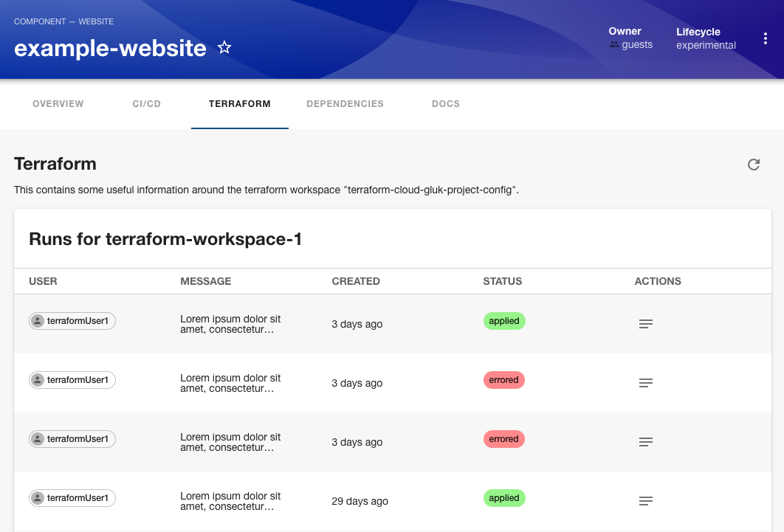
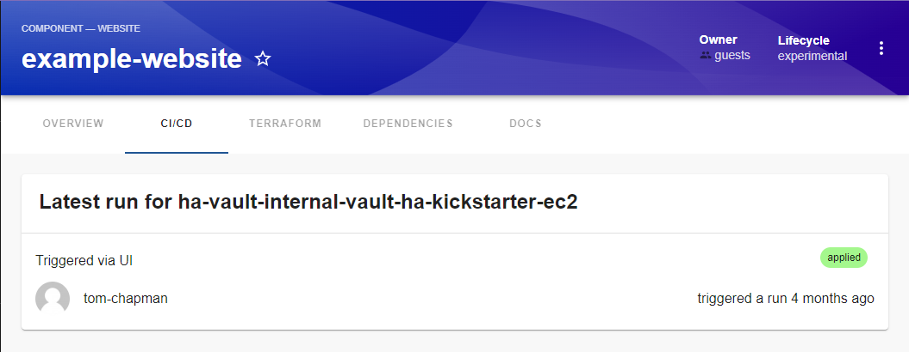

# Terraform Frontend Plugin for Backstage

You can use this plugin to display a list of terraform runs for a specific workspace.



## Install

```shell
yarn add @globallogicuki/backstage-plugin-terraform
```

## Setup

This plugin is designed to work in its own tab within an entity. You will need to add the `<EntityTerraformContent />` component to the entity page in the frontend app.

There is a `isTerraformAvailable` helper function and a `<EntityTerraformCard />` component available should you wish to use this within an existing tab.

Edit the `packages/app/src/components/catalog/EntityPage.tsx` and add the imports:

```typescript
import { EntityTerraformContent } from '@globallogicuki/backstage-plugin-terraform';
```

Then add the following route and component to the desired entity page:

```typescript
<EntityLayout.Route path="/terraform" title="Terraform">
  <EntityTerraformContent />
</EntityLayout.Route>
```

There are two annotations that you should add to your `catalog-info.yaml` file:

```yaml
annotations:
  terraform/organization: orgName
  terraform/workspace: workspaceName
```

<<<<<<< Updated upstream
You will also need to have the terraform backend plugin installed and running.
=======
You will also need to have the [terraform backend plugin](https://www.npmjs.com/package/@globallogicuki/backstage-plugin-terraform-backend) installed and running.

## Terraform Latest Run component



This is an additional component that can be referenced with `<EntityTerraformLatestRunCard>` and imported and added to the `EntityPage.tsx` file for routing.
>>>>>>> Stashed changes
